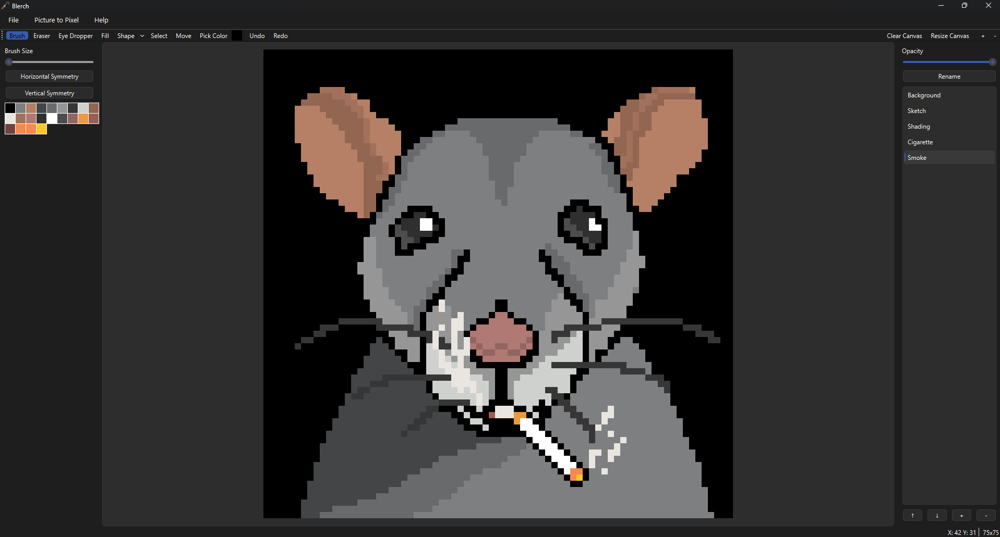
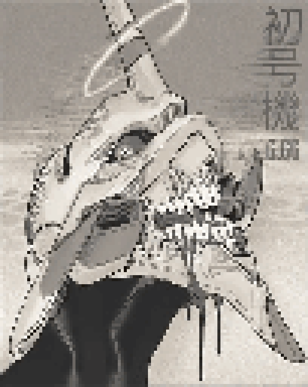

# Blerch Editor
A simple Desktop application built with Qt and C++ to make simple pixel art on a 32x32 grid.

## Features
- Brush, Eraser, Fill and eyedropper tools
- Select, Copy, Paste and Move pixels
- Custom color picker
- Custom Brush sizes
- undo and redo support
- Resize canvas
- Reset Canvas completely
- adjustable canvas zoom
- Frequency based color palette
- Symmetry Drawing
- import images for referencing with scaling and movement support
- Layers which includes
  - Add, delete and reorder layers
  - Adjust layer opacity
- Save and reload projects
- Export art as PNG with transparency support
- Turn any Picture into Pixel art with custom:
  - Height
  - Width
  - Fixed/dynamic aspect ratio
  - number of colors
- Keyboard and mouse shortcuts for most features mentioned
- Built in help menu showing all shortcut
- More on the way!! (If i dont forget about this)

(I may have forgotten some features lmao)


## Preview of Blerch Editor 

An inside look as of version 1.2.3 (I did NOT know how semantic versioning worked when I started naming releases lol)



## Made in Blerch Editor

(I can't draw for the life of me lol but i hope you can!)

<p float="left">

</p>

## Coming Soon
- Any feature suggestions are welcome!


## Clone the Repository
```bash
git clone https://github.com/RemTheGem/Blerch.git
```
