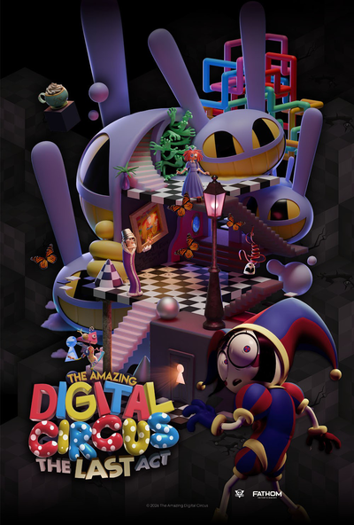
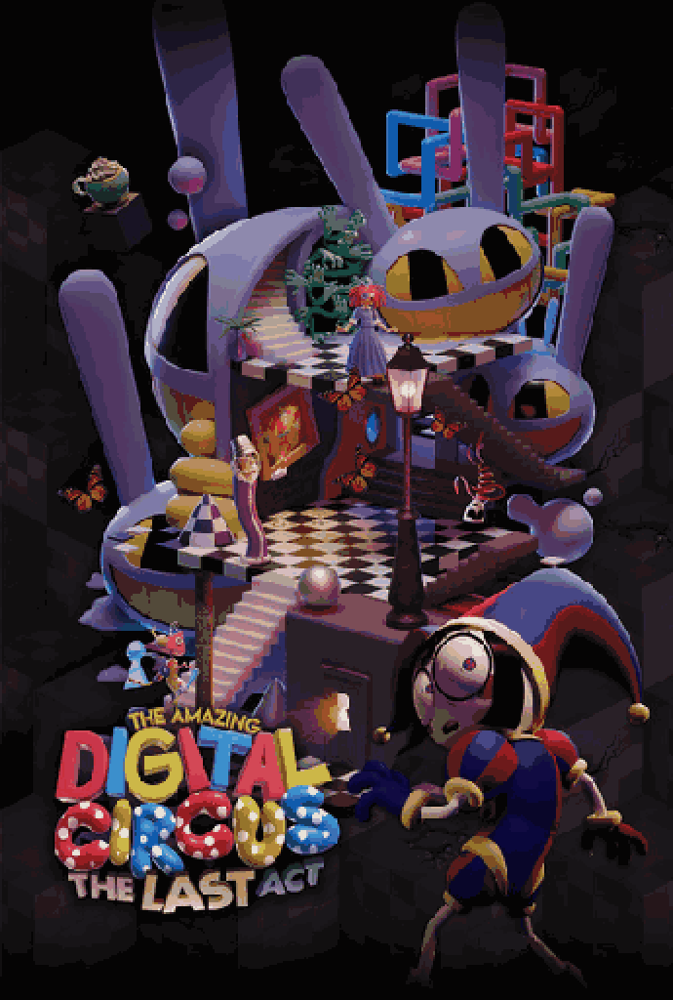

# Blerch Editor
A simple Desktop application built with Qt and C++ to make pixel art and animations with layers, frame animations, custom palettes and more!

## Features
### Drawing
- Brush, Eraser, Eyedropper, Fill, Select, Move
- Shape Tool: Rectangle, Circle, Ellipse, Line
- Adjustable brush size
- Horizontal and Vertical symmetry drawing
### Layers
- Add, remove, reorder, rename layers
- Per layer opacity
### Animation
- Frame timeline with add, duplicate, delete and, copy and paste frames
- Per frame duration and, live play and pause
### Color and Palettes
- Auto-generated frequency based palette built for each frame (Ranked by most frequent colors used to least)
- Builtin Palette presets with: Pico-8, Sweetie 16, DawnBringer 16/32, Endesga 32, Resurrect 64
- Import custom .gpl palettes
### Import / Export
- Import reference image as movable and scalable layer
- Convert photo into pixel art (with median cut color quantization)
  - You can choose your own width, height, number of colors used and aspect ratio
<p float="left">

</p>
(yes you can remove watermarks cuz its editable pixel art lol. credit to the original artist!)

- Convert GIF to pixel art (also median cut)
  - You can choose your own width, height, number of colors used and aspect ratio
<p float="left">

</p>

- Export as PNG, sprite sheets, GIF
  - Choose your own scale for gifs if you want to scale up or down
  - Choose your own columns for sprite sheets
- Save and load projects
### Misc
- Undo and redo
- Persistent memory for recent files
- Keyboard Shortcuts

- More on the way!! (If i dont forget about this)
(I may have forgotten some features lmao)

## Preview of Blerch Editor 

An inside look as of version 1.2.3 (I did NOT know how semantic versioning worked when I started naming releases lol)


## Made in Blerch Editor

(I can't draw for the life of me lol but i hope you can!)

<p float="left">

</p>
## Coming Soon
- Any feature suggestions are welcome!


## Compile it yourself!
Requires Qt 6 and C++17 compiler
Qt Creator
- Open the file in Qt creator
- select kit and build
### CMake
```bash
git clone https://github.com/RemTheGem/Blerch.git
cd Blerch
cmake -B build -S .
cmake --build build
```
